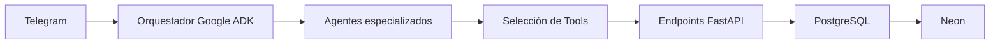

# Multiagente de pedidos de comida para VerdeFit

<div align="center">
  <p>
    <b>Automatización inteligente para la gestión de pedidos de comida.</b><br>
    Un sistema multiagente desarrollado con Google ADK para automatizar la atención,<br>
    gestión y procesamiento de pedidos de VerdeFit a través de Telegram.
  </p>
  <p>
    
    
    
    
    
    
    
  </p>
</div>

---

## 📖 Descripción del Proyecto

**VerdeFit Multiagent** es un sistema de automatización de pedidos desarrollado con **Python 3.13** y **Google ADK (Agent Development Kit)**.

El proyecto utiliza una arquitectura basada en **múltiples agentes especializados** que colaboran para gestionar el proceso de atención y pedidos de comida de VerdeFit.

Los clientes pueden realizar sus pedidos mediante **Telegram**, mientras que los agentes se encargan de interpretar las solicitudes, decidir qué herramientas utilizar y comunicarse con los servicios backend encargados de procesar y almacenar la información.

El sistema está diseñado para atender pedidos destinados tanto a **envío a lugares de trabajo** como a **recogida en el local**, reduciendo la intervención manual necesaria para gestionar cada pedido.

---

## 🎯 Problema

El crecimiento de VerdeFit ha incrementado la cantidad de pedidos que deben gestionarse diariamente.

Actualmente, gran parte del proceso se realiza de forma manual, generando principalmente:

* **Sobrecarga operativa:** el personal debe atender y procesar manualmente los pedidos.
* **Crecimiento limitado:** el proceso manual dificulta aumentar el volumen de pedidos sin incrementar proporcionalmente la carga de trabajo.
* **Procesos repetitivos:** muchas tareas relacionadas con los pedidos pueden ser automatizadas.

---

## 💡 Solución

Se propone implementar una arquitectura de **múltiples agentes especializados** utilizando el ecosistema de **Google ADK**.

Los agentes colaboran para interpretar las solicitudes de los clientes y determinar las acciones necesarias para completar cada pedido.

La arquitectura permite separar responsabilidades y utilizar herramientas específicas para cada operación, mientras que los servicios desarrollados con **FastAPI** proporcionan acceso a la lógica de negocio y a la base de datos.

De esta manera, el sistema busca convertir un proceso manual y repetitivo en un **flujo automatizado y coordinado mediante agentes de IA**.

---

## 🚀 Funcionalidades Principales

* **Atención mediante Telegram:** recepción de solicitudes y pedidos de los clientes.
* **Orquestación multiagente:** coordinación de agentes especializados mediante Google ADK.
* **Selección de herramientas:** los agentes determinan qué herramientas necesitan utilizar para resolver cada solicitud.
* **Integración con FastAPI:** comunicación con servicios backend mediante endpoints.
* **Persistencia de pedidos:** almacenamiento de la información en PostgreSQL mediante Neon.
* **Pedidos para delivery:** gestión de pedidos destinados a lugares de trabajo.
* **Pedidos para recojo:** posibilidad de gestionar pedidos para recoger directamente en el local.
* **Arquitectura modular:** separación entre agentes, herramientas, servicios y persistencia de datos.

---

## 🛠️ Stack Tecnológico

Construido con tecnologías modernas para desarrollar un sistema de agentes capaz de automatizar el flujo de pedidos.

| Tecnología      |                                                      Insignia                                                     | Uso                                               |
| :-------------- | :---------------------------------------------------------------------------------------------------------------: | :------------------------------------------------ |
| **Python 3.13** |              | Lenguaje principal del proyecto.                  |
| **Google ADK**  |      | Orquestación y coordinación de múltiples agentes. |
| **FastAPI**     |           | Desarrollo de los servicios y endpoints backend.  |
| **PostgreSQL**  |  | Base de datos relacional.                         |
| **Neon**        |                    | Servicio administrado de PostgreSQL.              |
| **Telegram**    |        | Canal de comunicación con los clientes.           |

---

## 📂 Flujo de Trabajo

El sistema utiliza un flujo donde Telegram actúa como punto de entrada y los agentes coordinan las operaciones necesarias para procesar cada solicitud.



### Flujo general

1. **Cliente:** realiza una solicitud mediante Telegram.
2. **Orquestador:** recibe la solicitud y determina qué agente debe intervenir.
3. **Agentes especializados:** analizan la solicitud y determinan las acciones necesarias.
4. **Tools:** los agentes utilizan las herramientas disponibles.
5. **FastAPI:** recibe las operaciones y ejecuta la lógica correspondiente.
6. **PostgreSQL / Neon:** almacena y consulta la información relacionada con los pedidos.
7. **Respuesta:** el resultado de la operación es devuelto al cliente mediante Telegram.

---

## ⚙️ Instalación y Configuración Local

Clona el repositorio e instala las dependencias necesarias para ejecutar el proyecto.

```sh
git clone <URL_DEL_REPOSITORIO>
cd <NOMBRE_DEL_PROYECTO>

# Instalar dependencias
uv sync

# Configurar variables de entorno
cp .env.template .env

# Ejecutar el proyecto
uv run ...
```

### Variables de entorno

Antes de ejecutar el proyecto, configura correctamente las variables definidas en `.env.template`.

> [!IMPORTANT]
> No compartas el archivo `.env` ni sus credenciales. Utiliza `.env.template` únicamente como referencia para configurar las variables necesarias.

---

## ⚠️ Consideraciones

* Verifica que las credenciales utilizadas por el proyecto sean válidas.
* Comprueba la disponibilidad de los modelos de **Gemini** configurados en Google ADK, ya que los modelos pueden cambiar o dejar de estar disponibles.
* Para conexiones con **Neon**, verifica la configuración de red de tu entorno si experimentas tiempos de espera o demoras.
* El sistema requiere que los servicios de **FastAPI**, la base de datos y los componentes necesarios para los agentes estén correctamente configurados.

---

## 🎥 Demostración

### Parte 1

[▶ Ver video de demostración](assets/parte01.mp4)

### Parte 2


---

## 👥 Equipo

<table>
  <tr>
    <td align="center">
      <a href="https://github.com/yassppy" target="_blank">
        <br />
        <sub><b>Miguel Mallqui</b></sub>
      </a>
    </td>
  </tr>
</table>
