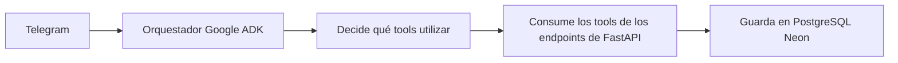

## Problema

Los clientes de VerdeFit necesitan realizar pedidos para envío a sus lugares de trabajo o para recogerlos en el local. Actualmente, VerdeFit gestiona los pedidos de forma manual, lo que ha generado los siguientes problemas:

- Sobrecarga operativa
- Crecimiento limitado

## Solución

Debido al crecimiento del negocio, se propone utilizar el ecosistema de Google ADK con múltiples agentes especializados que trabajan de forma coordinada para automatizar el proceso de pedidos.

## 🛠 Tech Stack

- Python 3.13
- Neon (PostgreSQL) como base de datos
- Google ADK para la orquestación de múltiples agentes

## Configuración

> [!IMPORTANT]
> Actualiza correctamente las credenciales del archivo `.env.template` y desactiva el protocolo TCP/IPv6 para evitar demoras en la conexión con Neon. Los modelos de Gemini podrían ya no estar disponibles; es necesario revisarlos.

## Flujo de trabajo

## Capturas de pantalla

### Parte 1

[▶ Ver video de demostración](assets/parte01.mp4)

### Parte 2

